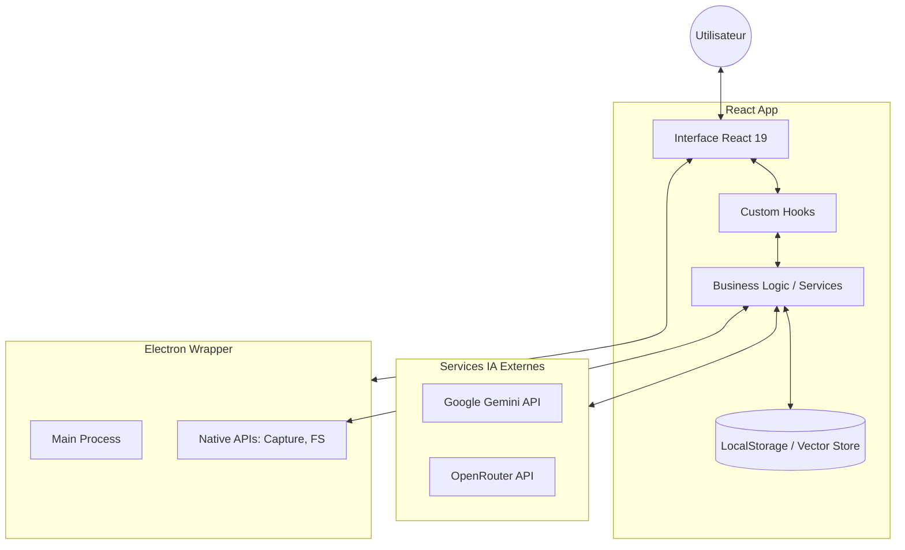

# 🏛️ Architecture Système — NeuroChat

Ce document décrit l'architecture technique de NeuroChat, un assistant personnel multimodal basé sur Electron et React.

---

## 🗺️ Vue d'ensemble

Le flux de données suit un modèle hybride : traitement local pour la gestion de l'interface et de la mémoire, et appels API asynchrones pour les capacités d'IA générative.

---

## 🎨 Frontend

L'application est construite avec **React 19** et **Vite**.

- **Structure des Composants** : Situés dans `src/components`, ils sont organisés de manière fonctionnelle (ex: `learning/`, `browserControl/`).
- **Routing** : Gestion interne simplifiée (pas de React Router complexe détecté, navigation par état dans `App.tsx`).
- **Gestion d'état** : Utilisation intensive de `useState`, `useReducer` et de Hooks personnalisés (`src/hooks`) pour encapsuler la logique complexe (ex: `useAIConversation`, `useAudioRecorder`).
- **Styling** : **Tailwind CSS 4** pour une interface moderne et réactive, avec **Motion** pour les animations fluides.

---

## 🖥️ Desktop / Electron

Le wrapper **Electron 35** permet d'accéder aux fonctionnalités natives du système d'exploitation.

- **Main Process** (`electron/main.cjs`) : Gère le cycle de vie de la fenêtre, les permissions et l'accès au système de fichiers.
- **IPC (Inter-Process Communication)** : Utilisé pour faire remonter les événements système au frontend.
- **Multimodalité** : Utilisation de `desktopCapturer` pour le partage d'écran et des APIs Web standard pour la caméra et le micro.

---

## 🤖 Services IA & Mémoire

### Intégrations Tierces
- **Google Gemini** : Utilisé pour le flux multimodal live (audio + vision) via WebSockets et pour la génération d'embeddings (`gemini-embedding-001`).
- **OpenRouter** : Utilisé comme service de secours (failover) pour la génération de texte et pour les synthèses hebdomadaires.

### Système de Mémoire (RAG)
- **Vector Store** (`src/lib/vectorStore.ts`) : Implémentation client-side de recherche sémantique utilisant la similarité cosinus.
- **Persistance** : Les sessions et les vecteurs sont stockés dans le **LocalStorage** du navigateur (ou d'Electron).
- **Extraction de contexte** : Recherche sémantique dans l'historique complet pour injecter les souvenirs pertinents dans le prompt système.

---

## 📈 Cycle d'Auto-Amélioration

NeuroChat inclut un workflow innovant d'apprentissage continu :

1. **Collecte** : Analyse des interactions et des feedbacks utilisateur.
2. **Analyse** : Détection des schémas (patterns) et des opportunités d'amélioration via un LLM.
3. **Optimisation** : Génération de propositions d'amélioration du prompt système.
4. **Validation** : Application contrôlée des changements et monitoring des performances.
5. **Régression** : Si la performance baisse, le système effectue un rollback automatique vers une version stable précédente.

---

## 🛡️ Décisions d'Architecture

- **Pourquoi Electron ?** Pour l'accès aux flux vidéo/audio système sans les restrictions de sécurité des navigateurs standards.
- **Pourquoi LocalStorage ?** Pour garantir que les données privées (historique, vecteurs) restent sur la machine de l'utilisateur.
- **Pourquoi RAG Client-Side ?** Pour minimiser la latence et les coûts serveurs tout en offrant une recherche contextuelle puissante.

---

> ⚠️ À compléter : Diagramme de base de données Mermaid ERD plus détaillé si le passage à SQLite est prévu.
