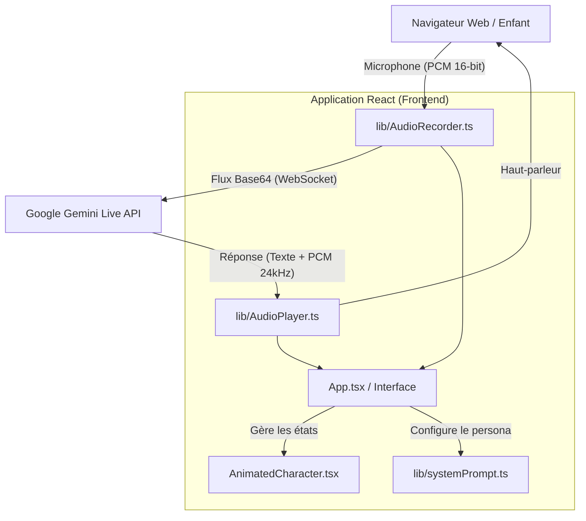

# Architecture du Système 🏗️

Ce document décrit l'architecture de **KidsVoice AI**.

Actuellement, l'application est un **produit Client-Side (SPA - Single Page Application)** en architecture Serverless qui dialogue directement avec une API tierce (Google API).

## 📊 Diagramme Global (MVP)

## 🖥️ Le Frontend (React + Vite)

Le frontend est conçu pour être rapide, réactif et très visuel pour capter l'attention des enfants.

- **Composants clés** : L'interface est majoritairement gérée dans `App.tsx` qui centralise l'état (`status`: idle, connecting, listening). Le visuel est délégué à de petits composants comme `AnimatedCharacter.tsx`.
- **Gestionnaire d'état** : L'état global est géré via des hooks React classiques (`useState` pour l'interface utilisateur, `useRef` pour persister les instances audio sans déclencher de re-renders).
- **Animations** : `motion/react` est préféré à la transition CSS classique (Tailwind) pour son contrôle granulaire (keyframes, ressorts 'spring', etc).

## ⚙️ Les Modules Techniques (Lib)

L'architecture isole les complexités des API Web (Audio et WebSocket) dans des classes dédiées :

1. **`AudioRecorder.ts`** : 
   - Accède au microphone via `navigator.mediaDevices`.
   - Utilise l'API `AudioContext` web moderne.
   - Convertit le `Float32Array` natif vers du `Int16Array` (requis par Gemini).
   - Encode le binaire en `Base64` via une callback déclenchée par les paquets audio.

2. **`AudioPlayer.ts`** :
   - Reçoit de l'audio `Base64` depuis l'API Gemini.
   - Gère une file d'attente temporellement ajustée (via `nextPlayTime` et `AudioContext.currentTime`) permettant de lire les "chunks" audio en streaming continu sans coupure.
   - Gère les interruptions de l'utilisateur (annulation du stream et reset d'AudioContext).

3. **`systemPrompt.ts`** :
   - Isole la personnalité de l'IH (Assistant enfant). Facilement éditable par des game designers ou concepteurs pédagogiques.

## 📡 Le Backend (Google Live API)

Dans cette version MVP, l'application **n'a pas de serveur Node.js propre ou backend base de données**. Elle utilise le **BaaS (Backend as a Service)** implicite fourni par l'API `ai.live.connect` (WebSocket de Google).

*Limitations de cette approche :*
La clé API `GEMINI` doit être injectée dans le code front (`process.env.GEMINI_API_KEY`). Dans un environnement de production public, un "Proxy Backend" sera exigé pour sécuriser les clés.

## 🗄️ Évolution vers une Base de Données

S'il est prévu d'ajouter une persistance (ex: via **Supabase**), l'architecture se divisera avec un Backend dédié. Voir le fichier `DB_SCHEMA.md` pour l'implémentation de la couche de données.
