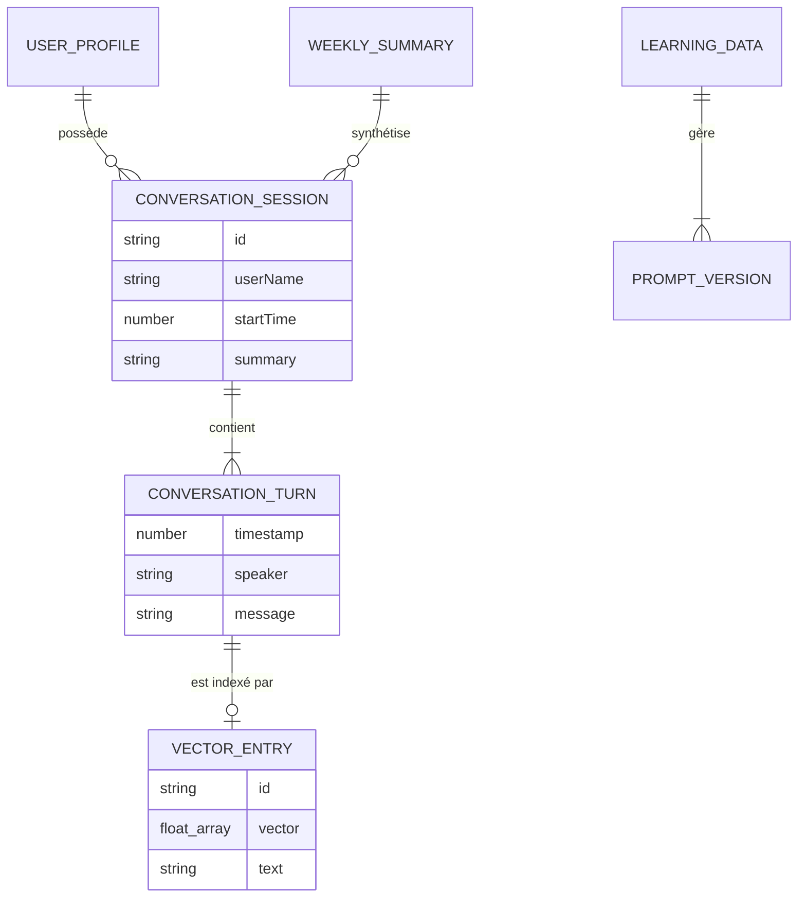

# 🗄️ Schéma de Base de Données — NeuroChat

NeuroChat utilise actuellement le **LocalStorage** du navigateur/Electron pour la persistance des données. Bien qu'il ne s'agisse pas d'une base de données relationnelle traditionnelle, les données sont structurées de manière prévisible.

---

## 🔑 Clés de Stockage

| Clé LocalStorage | Description | Structure |
| :--- | :--- | :--- |
| `neurochat_v2_memory` | Sessions de conversation | `ConversationSession[]` |
| `neurochat_v2_vectors` | Index de recherche sémantique | `VectorEntry[]` |
| `neurochat_v2_user_profile`| Profils utilisateurs | `Record<string, UserProfile>` |
| `neurochat_weekly_summaries`| Synthèses hebdomadaires | `WeeklySummary[]` |
| `neurochat_learning_data` | Données du système d'apprentissage | `LearningData` |

---

## 📋 Définition des "Tables" (Types)

### 1. `ConversationSession`
| Colonne | Type | Contraintes | Description |
| :--- | :--- | :--- | :--- |
| `id` | `string` | PK, Unique | ID unique de la session |
| `userName` | `string` | Requis | Nom de l'utilisateur |
| `startTime` | `number` | Requis | Timestamp de début |
| `endTime` | `number` | Optionnel | Timestamp de fin |
| `turns` | `Array<Turn>`| Requis | Liste des messages |
| `summary` | `string` | Optionnel | Résumé généré par l'IA |
| `topic` | `string` | Optionnel | Sujet principal détecté |

### 2. `VectorEntry`
| Colonne | Type | Contraintes | Description |
| :--- | :--- | :--- | :--- |
| `id` | `string` | PK, Unique | ID (Timestamp_Speaker) |
| `text` | `string` | Requis | Texte original |
| `vector` | `number[]` | Requis | Embedding (768 dimensions) |
| `metadata` | `object` | Requis | `{sessionId, userName, timestamp}` |

### 3. `LearningData`
Gère l'historique des versions du prompt système et les métriques de performance.
- `activeVersion`: Version actuelle du prompt.
- `versions`: Historique complet des itérations de prompts.
- `config`: Paramètres de seuils de régression et de fréquence de cycle.

---

## 📐 Diagramme ERD (Modèle Logique)

---

> ⚠️ À compléter : Schémas RLS et tables Supabase si une migration vers le Cloud est initiée.
