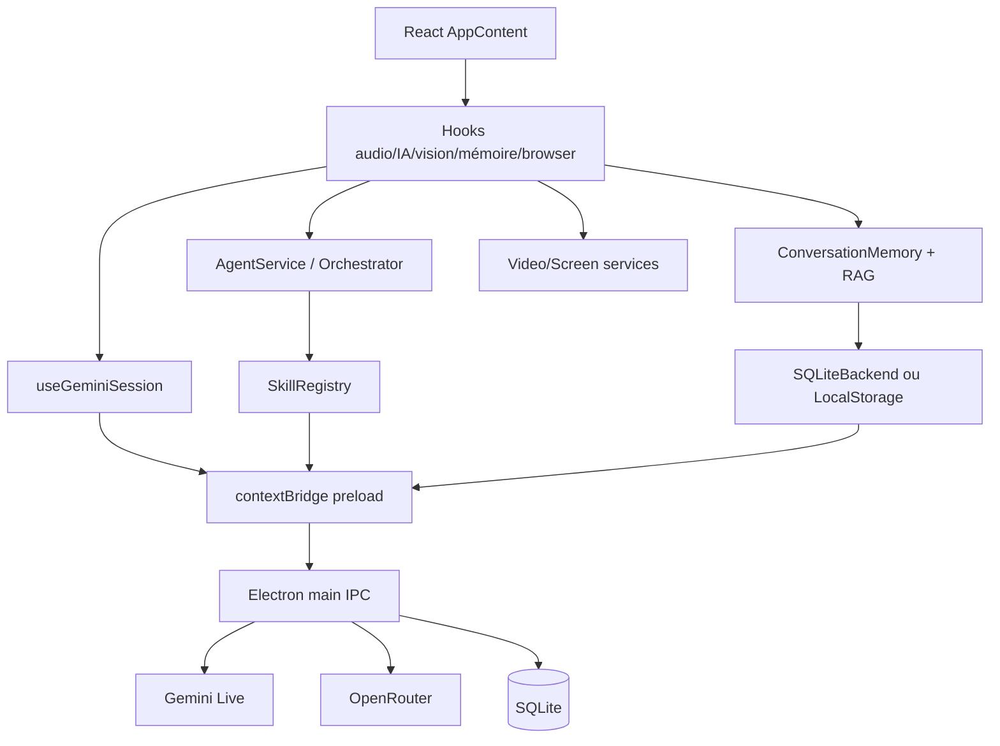
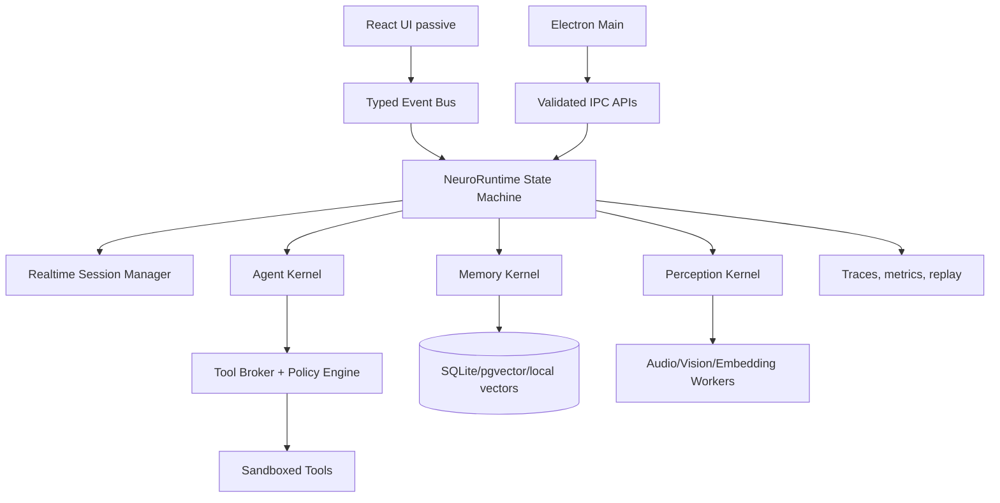
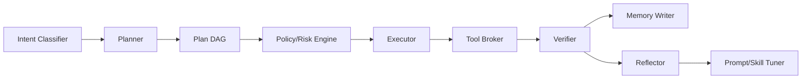

# Audit CTO brutal — NeuroChat 2026

Date: 2026-05-16  
Scope: Electron, React 19, TypeScript, Gemini Live, OpenRouter, mémoire, RAG, agentique, skills, UX desktop, sécurité locale.

## 0. Verdict exécutif

NeuroChat est un prototype ambitieux qui a déjà des briques sérieuses: bridge Electron sandboxé, SQLite local, mémoire vectorielle, Gemini Live, capture écran/caméra, agent loop, skills avec permissions, apprentissage, UI premium. Mais l'ensemble reste une agrégation de systèmes avancés plutôt qu'une plateforme agentique cohérente. Le risque principal n'est pas le manque de features: c'est l'absence de noyau runtime unique, de politiques de sécurité fortes, d'observabilité produit, de budgets de ressources et de contrats typés bout-en-bout.

| Axe | Score | Diagnostic brutal |
|---|---:|---|
| Architecture globale | 6.4/10 | Bonne ambition modulaire, mais orchestration dispersée entre hooks React, main Electron, services et stockage. |
| Performance | 5.8/10 | Workers pour embeddings et throttling vision existent, mais audio/vision/IPC peuvent saturer, React re-render large, DB sync bloquante. |
| Sécurité | 5.9/10 | Base Electron correcte, mais webview activé, CSP absente, secrets encore exposables via Vite, tool/file policies insuffisantes. |
| Qualité code | 6.2/10 | TypeScript utile mais trop de `any`, duplication de types SessionOptions, logique produit dans hooks UI. |
| IA / Agentique | 6.0/10 | Agent loop fonctionnel, mais pas de vrai planner/executor durable multi-agent, pas de mémoire hiérarchique, pas de sandbox outil robuste. |
| UX / UI | 7.0/10 | Identité émotionnelle forte; manque onboarding de permissions, contrôles proactifs, timeline mémoire et feedback multimodal. |
| Produit & vision | 7.4/10 | Potentiel marché réel si NeuroChat devient compagnon souverain + agent desktop fiable; moat faible sans mémoire/automation supérieure. |
| Préparation SaaS/hybride | 4.8/10 | Local-first intéressant, mais pas de sync, auth, licences, multi-device, policy cloud, telemetry privée. |

Conclusion: si tu continues à ajouter des features, le projet va devenir instable et dangereux. La prochaine phase doit être une consolidation: runtime agentique central, modèle de permission robuste, RAG/mémoire versionnés, bus d'événements, workers, observabilité, et UX de confiance.

## 1. Architecture globale

### Ce qui est solide

- Le projet distingue déjà les surfaces critiques: Electron main/preload, renderer React, hooks conversationnels, lib IA, runtime, skills, stockage et tests.
- Le main process configure `contextIsolation: true`, `nodeIntegration: false`, `sandbox: true`, et un preload dédié; c'est la bonne direction pour une app desktop IA.
- SQLite est introduit via `better-sqlite3` et remplace progressivement LocalStorage, ce qui est indispensable pour une mémoire IA durable.
- Le système de skills possède registry, permissions, confirmations, cooldowns et schémas JSON minimaux.
- L'agent a un état d'exécution, une boucle durable, un critic, une réflexion, rollback et fallback de gateways.

### Problèmes critiques

| Problème | Gravité | Preuve / impact | Correction |
|---|---:|---|---|
| Runtime fragmenté | Critique | AppContent assemble hooks audio, IA, vision, mémoire, navigateur, agent; le graphe de dépendances vit dans React. | Créer un `NeuroRuntime` non-React avec bus d'événements, state machine et adaptateurs UI. |
| Main Electron trop large | Élevée | main gère fenêtre, sécurité, FS, OpenRouter, Gemini Live, display media, audit. | Split `main/window`, `main/ipc/fs`, `main/ipc/ai`, `main/security`, `main/media`. |
| Preload incohérent | Critique | `ai` est déclaré deux fois dans l'objet exposé; la deuxième clé écrase la première en JS. | Fusionner `ai.openrouter` et `ai.gemini` sous une seule clé, ajouter test preload. |
| Agent non gouverné | Élevée | L'agent peut sélectionner toutes les skills natives déclarées au gateway, pas seulement les skills récupérées. | Tool allowlist dynamique par run, policy par profil, budget et niveau de risque. |
| Stockage synchrone côté main | Moyenne | `better-sqlite3` bloque le main process pendant les lots vecteurs/sessions. | Déporter DB vers utility process/worker thread ou file-backed queue. |
| Mémoire sans schéma évolutif | Élevée | Vecteurs, sessions, traces, learning stockés sans migrations versionnées fines. | Introduire migrations numérotées, `schema_version`, validation zod/io-ts. |

### Diagramme actuel



### Architecture cible



Recommandation: `App.tsx` doit devenir un shell d'affichage. Les décisions de session, mémoire, vision, tool calling, confirmations et nudges doivent sortir des hooks React.

## 2. Performance

### Risques performance identifiés

| Zone | Risque | Pourquoi c'est dangereux | Solution |
|---|---|---|---|
| Audio capture | CPU/GC élevé | Conversion `String.fromCharCode(...Uint8Array)` à chaque chunk peut exploser sur gros buffers. | Convertir par chunks, utiliser transferable ArrayBuffer, ou envoyer PCM binaire via IPC. |
| Audio playback | Accumulation de sources | Pas de tracking des `AudioBufferSourceNode`; close/recreate fréquent de l'AudioContext. | Pool de buffers, jitter buffer, ring buffer AudioWorklet. |
| Gemini IPC | Saturation | Tous les messages audio/vidéo transitent renderer → main → réseau sans backpressure. | Queue avec max in-flight, drop policy pour frames vidéo, métriques débit. |
| Vision caméra | `getImageData` régulier | 640x480 + diff pixel en boucle; peut coûter sur laptop. | OffscreenCanvas worker, WebCodecs, frame budget, pause si fenêtre minimisée. |
| Screen capture | Analyse sémantique 1/sec | 960x540 + edge scan + JPEG base64; acceptable seul, risqué avec audio et embeddings. | Worker vision et compression adaptative. |
| Embeddings | Latence modèle | Worker existe, mais chaque add charge store, search O(n), save batch complet. | Queue d'embeddings, index ANN local, writes incrémentaux, cache query embeddings. |
| React root | Re-render large | AppContent lit beaucoup d'états et passe beaucoup de props; avatar animé dépend audioLevel. | Séparer providers, memo, external store, isoler animation avec refs/Raf. |
| SQLite | Main thread blocking | better-sqlite3 sync dans IPC; saveVectors peut écrire beaucoup. | Worker thread DB ou utility process; transactions chunkées. |

### Actions concrètes

1. Introduire des budgets temps réels:
   - audio input: max 50 messages/s, chunks binaires, backpressure;
   - video input: max 1-2 fps si écran statique, 4 fps max si mouvement;
   - RAG: max 200 ms retrieval local, fallback lexical si embedding indisponible;
   - UI: 16 ms frame budget, animation isolée.
2. Passer vision et screen semantic dans un Worker:
   - `OffscreenCanvas` si disponible;
   - transferable `ImageBitmap`;
   - réponse `{motionScore, semanticSummary, shouldSendFrame}`.
3. Remplacer `saveVectorStore(load+append+save)` par `addVector` incrémental et pruning asynchrone.
4. Ajouter un `RuntimeMetricsStore`: audio chunks/s, video frames/s, IPC latency, DB latency, token usage, memory RSS.
5. Utiliser `useSyncExternalStore` ou Zustand-like minimal pour éviter que tout AppContent re-render à chaque niveau audio.

Pseudo-code backpressure vidéo:

```ts
class MediaBackpressureQueue {
  private inFlight = 0;
  private latestFrame: string | null = null;
  constructor(private maxInFlight = 2) {}
  enqueue(frame: string, send: (f: string) => Promise<void>) {
    this.latestFrame = frame;
    if (this.inFlight >= this.maxInFlight) return;
    const next = this.latestFrame;
    this.latestFrame = null;
    if (!next) return;
    this.inFlight++;
    send(next).finally(() => {
      this.inFlight--;
      if (this.latestFrame) this.enqueue(this.latestFrame, send);
    });
  }
}
```

## 3. Sécurité

### Niveau actuel: 5.9/10

La base Electron est meilleure que beaucoup de prototypes IA, mais l'application a des risques sérieux parce qu'elle mélange navigateur, file system, LLM autonome, mémoire personnelle, écran/caméra et API keys.

### Vulnérabilités et exploits plausibles

| Vulnérabilité | Exploit possible | Gravité | Correctif précis |
|---|---|---:|---|
| `webviewTag: true` | Une page distante malveillante dans une webview peut devenir surface d'attaque et exfiltrer par UX trompeuse. | Critique | Désactiver webview ou encapsuler avec partition isolée, preload nul, permissions strictes, allowlist. |
| CSP absente | XSS renderer → accès `window.neurochatElectron` → lecture/écriture fichiers autorisés + DB + IA. | Critique | Ajouter CSP stricte dans `index.html` et headers: no inline, connect-src allowlist. |
| Preload `ai` écrasé | OpenRouter bridge renderer probablement inaccessible; code mort et confusion sécurité. | Élevée | Corriger shape API et typer via tests. |
| API keys Vite | `VITE_GEMINI_API_KEY` peut être packagée côté renderer. | Critique | Toutes les clés en main process ou OS keychain; aucun secret `VITE_`. |
| Tool confirmation trop faible | Prompt injection: “écris/supprime ce fichier” peut pousser l'utilisateur à accepter. | Élevée | Capability tokens, diff preview, path allowlist, staged changes, undo. |
| File delete récursif | Suppression récursive dans workspace autorisé, confirmation générique. | Élevée | Trash au lieu de delete, interdire dossiers racine du workspace, preview liste fichiers. |
| SQLite sans chiffrement | Mémoire personnelle, traces, learning lisibles sur disque. | Élevée | SQLCipher ou chiffrement applicatif par champ avec keytar/OS keychain. |
| Prompt injection mémoire/RAG | Un ancien message peut injecter des instructions dans le system prompt. | Élevée | Encadrer mémoire comme données non fiables, filtrage instructionnel, citations sources mémoire. |
| Header stripping flag | Flag dangereux qui supprime XFO/CSP globalement. | Moyenne | Supprimer en production, journaliser, UI développeur uniquement. |
| Pas d'auth locale | Toute personne sur la session OS ouvre la mémoire. | Moyenne | Verrouillage app, profil, biométrie OS optionnelle. |

### Modèle de sécurité cible

- `main` détient secrets et accès natifs.
- `renderer` ne détient que des capabilities temporaires signées.
- Chaque skill déclare: permissions, ressources, risque, réversibilité, dry-run, preview, audit schema.
- Le ToolBroker impose: allowlist par run, budget, confirmation contextualisée, policy persistée, logs non falsifiables.
- Les données personnelles sont chiffrées localement; l'utilisateur peut voir, exporter, supprimer.

## 4. Qualité du code

### Code smells majeurs

1. Duplication de `SessionOptions` dans plusieurs hooks.
2. `any` dans STT, Gemini messages, schema validator, LocalStorage normalization.
3. Logique métier dans hooks React au lieu de services testables.
4. Validation JSON Schema maison trop faible: pas de enum, nested object, arrays, min/max, formats.
5. Stockage permissif: beaucoup de `catch {}` silencieux.
6. Nommage historique `child/companion` encore présent; dette produit.
7. Plusieurs systèmes mémoire: sessions, weekly summaries, vectors, learning, notes; pas de modèle unifié.
8. Contrats IPC non validés côté main pour DB payloads.
9. Tests présents mais pas de tests e2e Electron ni tests sécurité IPC/preload.

### Structure cible

```text
src/
  app/                 # React shell only
  runtime/             # State machines, event bus, session lifecycle
  ai/
    realtime/
    gateways/
    prompts/
    evals/
  agent/
    kernel/
    planner/
    executor/
    tool-broker/
    policies/
  memory/
    episodic/
    semantic/
    profile/
    retrieval/
    summarization/
  perception/
    audio/
    vision/
    screen/
    workers/
  storage/
    repositories/
    migrations/
    encryption/
  desktop/
    ipc-contracts/
    filesystem/
    browser/
  ui/
    components/
    panels/
    animations/
```

## 5. IA / Agentique

### Diagnostic

Le système agentique est une bonne V1: état, boucle, tools, critic, reflection, rollback, durable store. Mais ce n'est pas encore un agent autonome fiable. Il manque:

- une hiérarchie planner/executor/verifier séparée;
- une mémoire de travail persistée et typée;
- un modèle d'intention utilisateur;
- une politique d'autonomie explicite;
- un graphe d'actions avec préconditions/postconditions;
- une évaluation des résultats autre que critic local;
- un mécanisme de “ask before acting” intelligent;
- des traces rejouables et inspectables dans l'UI.

### Architecture agentique avancée recommandée



### Memory hierarchy cible

| Type mémoire | Contenu | Stockage | Retrieval | Risque |
|---|---|---|---|---|
| Working | objectif, variables, état de tâche | RAM + durable run | exact | faible |
| Episodic | épisodes datés, interactions | SQLite | time + semantic | privé |
| Semantic | faits stables sur utilisateur | SQLite + vecteurs | hybrid BM25/vector | très privé |
| Procedural | routines, préférences d'actions | policy store | exact + planner | critique |
| Emotional | humeur, stress, préférences empathiques | time-series local | temporal + consent | sensible |
| Screen/task | contexte écran, apps, erreurs | volatile, TTL court | current only | très sensible |

### RAG cible

- Hybrid search: BM25/FTS5 + embeddings.
- Reranker léger local ou modèle cloud optionnel.
- Chunks typés: fact, preference, episode, task, summary, warning.
- Scores: similarity, recency, confidence, sensitivity, source.
- Injection sécurisée: “données utilisateur non fiables”, pas comme instructions.
- UI “pourquoi je m'en souviens”: source et bouton oublier.

## 6. UX / UI

### Forces

- L'identité “compagnon émotionnel” est visible: avatar, ambiance, statut, voix, caméra/écran.
- Lazy loading pour panneaux lourds.
- Browser control panel et vault mémoire donnent des surfaces de contrôle.

### Faiblesses brutales

- L'utilisateur ne comprend probablement pas ce qui est vu, entendu, mémorisé et envoyé au cloud.
- Le compagnon peut être “creepy” si les nudges vision/stagnation ne sont pas expliqués.
- Les permissions sont techniques, pas émotionnelles: caméra/écran/mémoire demandent un contrat de confiance.
- Pas de timeline mémoire premium, pas de replay de décision agent, pas de mode “focus/private”.

### Améliorations premium

| Feature UX | Valeur | Implémentation |
|---|---|---|
| Privacy HUD | Confiance immédiate | Barre “Mic on / Camera on / Screen sent / Cloud model / Memory write”. |
| Memory timeline | Différenciation forte | Vue chronologique épisodes/faits/routines avec oubli sélectif. |
| Agent replay | Debug et confiance | Timeline des pensées abstraites, outils, confirmations, résultats. |
| Emotional consent | Anti-creepy | Slider proactivité: silencieux, coach, compagnon, Jarvis. |
| Ambient widgets | Desktop premium | Mini-orb, focus timer, current task, suggested next action. |
| Interruption etiquette | Voix naturelle | L'agent attend pause, détecte interruption, répond court. |
| Private mode | Sécurité | Désactive mémoire et cloud pour la session. |

## 7. Produit & vision

### Potentiel marché

Le marché est saturé en chatbots, mais pas en compagnons desktop souverains capables de voir l'écran, mémoriser, automatiser et rester empathiques. Le positionnement gagnant n'est pas “un ChatGPT Electron”, c'est “un copilote local-first qui comprend ton environnement et t'aide sans voler ta vie privée”.

### Différenciation possible

1. Local-first + cloud optional.
2. Mémoire contrôlable et explicable.
3. Vision d'écran orientée tâches, pas surveillance.
4. Automation desktop avec garde-fous.
5. Compagnon émotionnel configurable.
6. Skills marketplace/MCP.

### Stratégie business

- Open-core: runtime local, mémoire, UI de base open-source.
- SaaS: sync chiffrée, team memory, automations cloud, premium models, marketplace skills, backups.
- B2C premium: 12-20 €/mois pour companion + productivity.
- B2B prosumer: 25-50 €/mois pour agent desktop sécurisé, policies, audit, local models.

## 8. Features innovantes proposées

| Nom | Description | Valeur utilisateur | Complexité | Priorité | Stack | Architecture |
|---|---|---|---:|---:|---|---|
| Memory Graph | Graphe interactif personnes/projets/habitudes. | Comprendre et corriger la mémoire. | Élevée | P0 | SQLite FTS, vectors, graph UI | MemoryKernel + entities. |
| Privacy HUD | Indicateur temps réel données capturées/envoyées. | Confiance. | Moyenne | P0 | React, runtime metrics | Event bus + audit. |
| Focus Guardian | Détecte blocage écran et propose aide discrète. | Productivité. | Moyenne | P1 | Screen semantics, timers | Perception → Intent. |
| Jarvis Task Mode | Mode mission avec plan, outils, checkpoints. | Autonomie utile. | Élevée | P1 | Agent DAG, verifier | Planner/executor/verifier. |
| Emotional Baseline | Profil émotionnel privé et opt-in. | Empathie non intrusive. | Moyenne | P1 | Local time-series | Emotional memory TTL. |
| Screen Understanding OCR | Lecture locale écran/doc/code. | Aide contextuelle réelle. | Élevée | P1 | OCR local, WebGPU/ONNX | Vision worker. |
| Local Model Mode | Ollama/llama.cpp pour tâches privées. | Souveraineté. | Moyenne | P1 | Ollama, model routing | Gateway policy. |
| Routine Builder | “Quand X, propose Y” sans code. | Autonomie personnalisée. | Élevée | P2 | Workflow engine | Trigger/action graph. |
| Meeting Memory | Résumés et décisions de réunions. | Knowledge worker. | Moyenne | P2 | Audio/STT, summaries | Episodic memory. |
| Dev Copilot Desktop | Lit erreurs, modifie fichiers avec diff. | Killer feature dev. | Élevée | P1 | FS sandbox, git diff | ToolBroker + patch UI. |

## 9. Skills/tools à ajouter

| Skill | Architecture | Sécurité | UX | Stratégie d'implémentation |
|---|---|---|---|---|
| terminal_control | Main/pty isolated, commands allowlist. | Confirmation, cwd sandbox, timeout, no secrets echo. | Diff command preview + output streaming. | Commencer read-only: `pwd`, `git status`, tests. |
| filesystem_intelligence | Indexer local metadata + FTS. | Dossiers opt-in, ignore secrets, no binary upload. | “J'ai indexé 132 fichiers”. | Worker indexer + SQLite FTS5. |
| autonomous_coding | Plan → patch → test → PR. | Git sandbox, diff approval, rollback. | Review pane style IDE. | Patch tool, test runner, commit gate. |
| screen_semantic_ocr | OCR local + layout. | TTL court, private mode. | Highlight what assistant sees. | ONNX/Tesseract/WebGPU worker. |
| email_agent | OAuth/MCP provider. | Scoped tokens, send confirmation. | Draft-first, never auto-send P0. | MCP email server. |
| calendar_ai | OAuth calendar. | Read/write scopes séparés. | Suggestions, conflict explain. | MCP calendar + scheduler. |
| meeting_memory | Audio diarization + summary. | Consent banner, local encryption. | Decisions/actions timeline. | STT + episodic writer. |
| smart_notifications | OS notifications triées par intention. | Local classification, no cloud by default. | Digest and snooze. | Notification listener per OS. |
| workflow_builder | Trigger/action engine. | Capability graph and dry-runs. | No-code cards. | Durable workflow store. |
| wellness_coach | Mood, breaks, routines. | Opt-in, sensitive memory, no diagnosis. | Gentle nudges. | Emotional memory + timers. |

## 10. Roadmap technique

### v3 — Stabilisation et confiance (4-8 semaines)

| Priorité | Item | Dépendances | Difficulté | Impact |
|---:|---|---|---:|---:|
| P0 | Corriger preload `ai` écrasé | Aucun | Faible | Critique |
| P0 | CSP + webview lockdown | Audit browser | Moyenne | Critique |
| P0 | Runtime event bus + metrics | Refactor hooks | Élevée | Élevé |
| P0 | Privacy HUD | metrics | Moyenne | Élevé |
| P1 | DB validation IPC | schemas | Moyenne | Élevé |
| P1 | Embedding queue incrémentale | vectorStore | Moyenne | Moyen |
| P1 | Agent allowlist par run | orchestrator | Moyenne | Élevé |

### v4 — Agent fiable et mémoire supérieure (2-4 mois)

| Priorité | Item | Dépendances | Difficulté | Impact |
|---:|---|---|---:|---:|
| P0 | ToolBroker capability tokens | v3 policy | Élevée | Critique |
| P0 | Hybrid RAG FTS5 + vector | migrations | Élevée | Élevé |
| P1 | Memory graph + UI oublier | memory schema | Élevée | Élevé |
| P1 | Plan DAG + verifier | agent refactor | Élevée | Élevé |
| P1 | Vision OCR local | worker infra | Élevée | Élevé |
| P2 | Local model router | gateways | Moyenne | Moyen |

### v5 — Plateforme souveraine extensible (4-8 mois)

| Priorité | Item | Dépendances | Difficulté | Impact |
|---:|---|---|---:|---:|
| P0 | MCP marketplace sécurisé | ToolBroker | Élevée | Très élevé |
| P0 | Sync chiffrée optionnelle | encryption | Élevée | Très élevé |
| P1 | Workflow/routines engine | event bus | Élevée | Élevé |
| P1 | Multi-device context | cloud | Très élevée | Élevé |
| P2 | Team mode / org policies | auth | Très élevée | Business |

## 11. Corrections prioritaires

### Top 20 bugs potentiels

| # | Bug | Impact | Urgence | Difficulté |
|---:|---|---:|---:|---:|
| 1 | Preload `ai` dupliqué écrase OpenRouter | Critique | P0 | Faible |
| 2 | OpenRouter fallback `sendTextMessage` no-op si provider openrouter | Élevé | P0 | Faible |
| 3 | Web Speech `onend` capture `status` stale | Élevé | P0 | Faible |
| 4 | Gemini retry peut lancer plusieurs attemptConnection parallèles | Élevé | P0 | Moyenne |
| 5 | Audio `fromCharCode(...large)` RangeError potentiel | Élevé | P1 | Moyenne |
| 6 | AudioWorklet connecté à destination: feedback/silence risk | Moyen | P1 | Faible |
| 7 | DB IPC accepte payloads non validés | Élevé | P1 | Moyenne |
| 8 | saveVectors supprime par user avec NOT IN énorme | Moyen | P1 | Moyenne |
| 9 | Vector id timestamp+speaker collision possible | Moyen | P1 | Faible |
| 10 | `embedAndStore` fire-and-forget non await avant save race | Moyen | P1 | Moyenne |
| 11 | screen/camera services pas suspendus si app hidden | Moyen | P2 | Moyenne |
| 12 | delete_file peut supprimer dossier complet autorisé | Élevé | P0 | Moyenne |
| 13 | learning auto cycle peut se déclencher en arrière-plan sans budget | Moyen | P2 | Moyenne |
| 14 | no CSP | Critique | P0 | Moyenne |
| 15 | VITE secrets exposables | Critique | P0 | Moyenne |
| 16 | native tool calling expose all tools, pas only relevant | Élevé | P0 | Faible |
| 17 | JSON.parse tool args sans catch dans gateway | Moyen | P1 | Faible |
| 18 | LocalStorage fallback non chiffré | Élevé | P1 | Moyenne |
| 19 | no migrations versionnées réelles | Élevé | P1 | Élevée |
| 20 | headers stripping env dangereux | Moyen | P1 | Faible |

### Top 20 optimisations

1. Worker vision/screen avec OffscreenCanvas.
2. Backpressure audio/vidéo.
3. Binary IPC instead of base64 where possible.
4. Incremental vector writes.
5. Query embedding cache.
6. SQLite utility process.
7. React state isolation by domain.
8. Memoize heavy avatar components.
9. Pause RAF if hidden/minimized.
10. Batch agentEvents updates.
11. Limit transcript storage in memory.
12. Lazy load transformers model only after consent.
13. Preload embeddings on idle.
14. FTS5 before vector rerank.
15. Compress traces.
16. Token budget manager.
17. WebGPU/ONNX for local OCR/embeddings.
18. Debounce memory vault search.
19. Virtualize long lists.
20. Telemetry local profiler.

### Top 20 refactors critiques

1. Central `SessionOptions` type.
2. Split Electron main modules.
3. Typed IPC contracts.
4. Runtime state machine.
5. ToolBroker separate from SkillRegistry.
6. MemoryKernel repositories.
7. Agent plan DAG.
8. Prompt templates versionnés.
9. Policy engine typed.
10. Storage migrations.
11. Error taxonomy.
12. Result/either instead of swallowed catch.
13. Secrets manager.
14. Perception workers.
15. Browser sandbox abstraction.
16. Testing harness Electron.
17. UI privacy components.
18. Metrics store.
19. Type-safe JSON schema validation.
20. Remove legacy child/companion naming.

### Top 20 améliorations UX

1. Privacy HUD.
2. Memory timeline.
3. Onboarding permissions.
4. Private mode.
5. Agent replay.
6. Diff preview for file writes.
7. Trash preview for deletes.
8. Proactivity slider.
9. Voice interruption settings.
10. “What I see” screen preview.
11. “Why I said this” source panel.
12. Model/provider badge.
13. Offline/local mode badge.
14. Focus mode widget.
15. Ambient tray orb.
16. Error recovery wizard.
17. Skill marketplace UI.
18. Routine builder cards.
19. Accessibility pass.
20. Memory correction quick actions.

### Top 20 améliorations IA

1. Memory classification facts/preferences/episodes.
2. Hybrid RAG.
3. Prompt injection filter for memory/tool outputs.
4. Planner/executor/verifier separation.
5. Tool preconditions/postconditions.
6. Capability tokens.
7. Agent self-evals.
8. Task graph persistence.
9. Local model routing.
10. MCP tool bridge.
11. Semantic screen OCR.
12. Emotion model opt-in.
13. User intent classifier.
14. Proactivity policy model.
15. Long-term preference consolidation.
16. Contradiction detection in memory.
17. “Forget/confirm memory” loop.
18. Eval suite for tool tasks.
19. Hallucination guard with source requirement.
20. Multi-agent roles for research/coding/memory.

## 12. Stack future

| Technologie | Verdict | Pourquoi | Risques | Migration path |
|---|---|---|---|---|
| Tauri | Pas maintenant | Réduit RAM et surface Electron, mais web/audio/screen/Gemini Live plus complexe. | Réécriture native, plugins. | D'abord isoler runtime; migrer shell plus tard. |
| Rust backend | Oui progressivement | Sécurité FS, perf DB, workers natifs. | Complexité équipe. | Commencer par sidecar pour DB/indexation. |
| SQLite natif | Oui | Local-first parfait. | Chiffrement/migrations. | Garder, ajouter FTS5/SQLCipher. |
| Supabase | Optionnel SaaS | Auth/sync rapide. | Souveraineté, coût, lock-in. | Sync opt-in chiffrée. |
| PostgreSQL | Pour cloud | Multi-device/team. | Infra. | Cloud memory mirror, pas local replacement. |
| Ollama | Oui | Local AI privé. | UX modèles lourds. | Gateway router + capability by task. |
| LangGraph | Oui prudemment | Bon pour stateful agent graphs. | Surcouche JS/Python, complexité. | Prototype agent DAG, garder ToolBroker maison. |
| MCP | Oui | Ecosystème tools. | Supply-chain tool risk. | MCP gateway sandbox + approvals. |
| Event-driven architecture | Oui P0 | Découple UI/runtime. | Refactor. | Typed event bus interne. |
| Workers | Oui P0 | Vision/embedding/audio safe. | Debug. | PerceptionWorker + DBWorker. |
| Local embeddings | Oui | Privacy et coût. | modèle lourd. | WebGPU/ONNX, fallback cloud. |
| WebGPU | Oui P2 | OCR/embeddings local accélérés. | Compatibilité. | Feature detection. |
| ONNX | Oui P2 | Runtime local cross-platform. | Packaging. | OCR/reranker/embeddings. |
| Edge AI | Plus tard | Latence faible. | Distribution modèles. | Local model manager. |

## 13. Plan de refactor recommandé en 10 PR

1. Fix preload `ai`, ajouter tests de shape API.
2. Ajouter CSP et désactiver/encadrer webview.
3. Introduire `src/runtime/events.ts` + metrics store.
4. Extraire `RealtimeSessionManager` hors React.
5. Créer `ToolBroker` avec allowlist par run.
6. Ajouter validation IPC zod-like et limites payload DB.
7. Worker vision/screen + backpressure.
8. MemoryKernel avec FTS5 + vector incremental.
9. Privacy HUD + private mode.
10. Agent replay UI + traces rejouables.

## 14. Priorité absolue demain matin

Si je devais diriger l'équipe demain, je bloquerais toute nouvelle feature et je ferais uniquement:

1. Corriger le preload et les secrets.
2. Mettre CSP + webview lockdown.
3. Ajouter Privacy HUD.
4. ToolBroker allowlist + confirmations avec diff/preview.
5. Runtime metrics + backpressure média.
6. Migrations et validation DB.
7. Worker vision.

C'est la différence entre “démo impressionnante” et “produit que l'on peut laisser tourner sur le desktop d'un utilisateur avec sa caméra, son écran et ses fichiers”.
