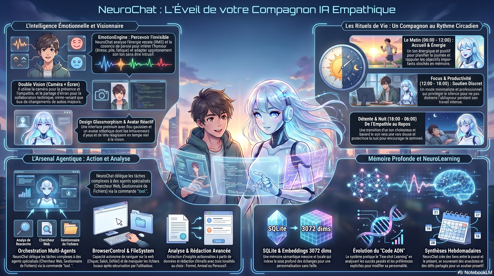

# 🧠 NeuroChat

> **Votre Compagnon de Vie qui Voit et Ressent** — Un ami IA multimodal, proactif et empathique avec mémoire SQLite persistante, analyse émotionnelle et design premium.

<div align="center">
  
  

  
  
  
  

  **[Fonctionnalités](#-fonctionnalités)** · **[Démarrage Rapide](#-démarrage-rapide)** · **[Architecture](#-architecture)** · **[Runtime Agentique](#-runtime-agentique--skills)** · **[Contribution](#-contribution)**
</div>

---

## 🌟 Pourquoi NeuroChat ?

La plupart des assistants IA sont des outils passifs. **NeuroChat est un compagnon.** Il s'exécute sur votre bureau, vous voit via votre caméra, ressent votre énergie par votre voix, et adapte son comportement à votre rythme de vie (matin, travail, détente). Grâce à sa mémoire SQLite à long terme, il ne se contente pas de répondre à vos questions : il évolue avec vous pour devenir un soutien proactif au quotidien.

---

## ✨ Fonctionnalités

### 🎭 Intelligence Émotionnelle & Réactivité (v2.3)
NeuroChat ne se contente pas d'écouter les mots, il perçoit l'intention et l'énergie.

| Capacité | Description |
|:---|:---|
| **Analyse d'Énergie** | Détecte l'agitation ou le calme via le niveau audio (RMS) et la cadence de parole |
| **Humeur Probable** | Infère votre état (stressé, joyeux, calme) pour adapter spontanément son ton |
| **Avatar Émotionnel** | L'avatar `RobotAvatar` est réactif à la vision (yeux saccadés, inclinaisons de tête attentives) |
| **Design Glassmorphism** | Interface premium avec flou gaussien, textures de grain (noise) et hiérarchie visuelle haut de gamme |

### 🕰️ Rituels de Vie & Proactivité
L'IA adapte son comportement selon votre cycle quotidien.

| Phase | Comportement |
|:---|:---|
| **Matin** | Énergique, synthétique, prêt pour la planification de journée |
| **Travail (Focus)** | Discret, ne parle que sur demande, aide à la concentration |
| **Détente** | Chaleureux, conversationnel, partage des curiosités |
| **Nuit** | Voix douce, réponses courtes, encourage le repos |

### 👁️ Vision Contextuelle & Intelligence Visuelle
NeuroChat voit ce que vous voyez et comprend votre contexte visuel de manière intelligente.

| Capacité | Description |
|:---|:---|
| **Double Vision (Cam + Écran)** | Activez caméra et partage d'écran simultanément avec double PiP |
| **Moteur de Mouvement Smart** | Seuil à 15% + 3 frames consécutives — seuls les vrais changements de scène déclenchent l'analyse |
| **Silence par Défaut** | L'IA observe silencieusement et n'intervient que sur des événements majeurs |

### 📂 Système de Fichiers & Web Agentique
Une architecture hiérarchique `Supervisor` -> `Agents` pour des tâches complexes.
- **Chercheur Web** : Navigation via `<webview>` pour extraire des données sans restrictions.
- **Gestionnaire de Fichiers** : Lecture/Écriture locale via pont IPC sécurisé.
- **Séquençage Autonome** : Enchaînement de tâches : *"Cherche les actus IA, résume-les et crée un fichier .md"*.

### 🧠 Mémoire à Long Terme SQLite
- **Massive Performance** : Migration de LocalStorage vers SQLite pour une scalabilité infinie.
- **Batch Processing** : Sauvegarde des vecteurs et sessions par lots avec transactions atomiques.
- **Vector Store Local** : Embeddings 3072 dims stockés nativement pour une recherche sémantique instantanée.

---

## 🚀 Démarrage Rapide

### Prérequis
- **Node.js** ≥ 20.x
- **Clé API Gemini** — Requise pour les sessions live et les embeddings.
- **Clé API OpenRouter** — Optionnelle, pour les résumés et le failover.

### Installation

```bash
git clone https://github.com/moonback/NeuroChat.git
cd NeuroChat
npm install
cp .env.example .env # Éditez avec vos clés
```

### Lancement

```bash
npm run electron:dev  # Mode Desktop (Recommandé)
npm run dev           # Mode Web uniquement
```

---

## 🏗 Architecture

```
src/
├── components/        # UI (Avatar, Browser, Vault, Debug, Emotion)
├── hooks/             # Logique (Gemini, OpenRouter, EmotionEngine)
├── lib/               # Moteurs (CommandParser, BrowserControl, Memory, SQLite)
│   ├── agent/         # Runtime Agentique (Orchestrator, Planner)
│   └── learning/      # Système d'auto-amélioration
└── skills-md/         # Rituels de Vie & Compétences Markdown
```

---

## 🗺️ Roadmap

- [x] Interaction vocale multimodale (Gemini Live)
- [x] Mémoire long terme SQLite (Performance & Scalabilité)
- [x] **Rituels de Vie** : Adaptation au cycle quotidien (Matin, Travail, Nuit)
- [x] **Analyse Émotionnelle** : Détection humeur/énergie via voix & vision
- [x] **Refonte UI Premium** : Design Glassmorphism & Avatar réactif
- [x] Double Vision (Caméra + Écran) & Silence par Défaut

#### **Phase Prochaine : Mémoire Visuelle & Contexte Profond**
- [ ] **Journal Visuel Persistant** : Se souvenir des objets vus dans le passé.
- [ ] **Ancrage Spatial** : Comprendre la géométrie de l'environnement immédiat.
- [ ] **Vision Collaborative** : Analyse de documents physiques en temps réel.

---

## 🤝 Contribution

Les contributions sont les bienvenues ! Consultez notre [Guide de Contribution](CONTRIBUTING.md).

---

<div align="center">
  <sub>Fait avec ❤️ par <a href="https://github.com/moonback">moonback</a></sub>
</div>
