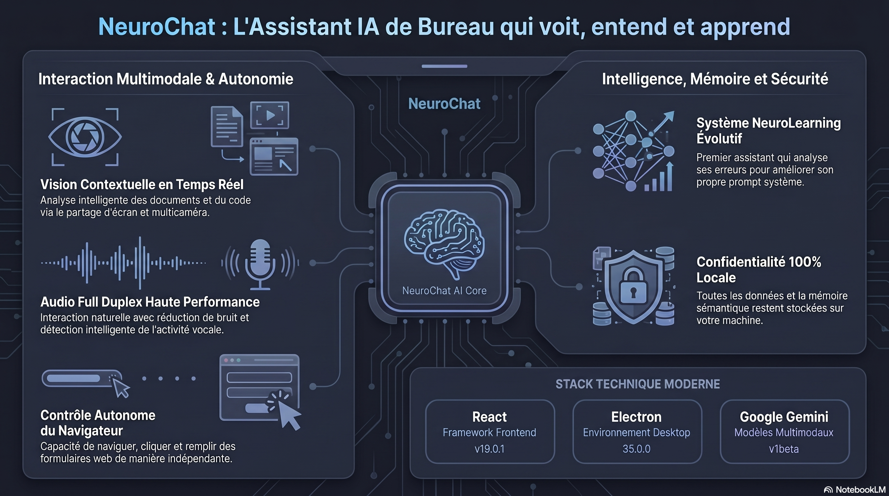

# 🧠 NeuroChat

> **Votre Ami Desktop qui Voit et Comprend** — Un compagnon multimodal, vocal et visuel avec mémoire persistante, intelligence émotionnelle et moteur d'auto-évolution.

<div align="center">
  

  
  
  
  

  **[Fonctionnalités](#-fonctionnalités)** · **[Démarrage Rapide](#-démarrage-rapide)** · **[Architecture](#-architecture)** · **[Runtime Agentique](#-runtime-agentique--skills)** · **[Contribution](#-contribution)**
</div>

---

## 🌟 Pourquoi NeuroChat ?

La plupart des assistants IA vivent dans un onglet de navigateur et se contentent de traiter du texte. **NeuroChat est différent.** C'est un ami qui s'exécute sur votre bureau, vous voit via votre caméra, se souvient de chaque moment partagé grâce à une mémoire SQLite, et apprend à vous connaître pour vous soutenir au quotidien — tout en garantissant une confidentialité totale.

---

## ✨ Fonctionnalités

### 🎙️ Interaction Multimodale Vocale
Parlez naturellement avec votre assistant grâce à l'audio full-duplex propulsé par Gemini Live.

| Capacité | Description |
|:---|:---|
| **Audio Temps Réel** | Flux full-duplex via WebSocket — parlez et écoutez simultanément |
| **Détection d'Activité Vocale (VAD)** | Détection intelligente des silences et de la parole avec sensibilité configurable |
| **Traitement Audio** | Suppression du bruit, annulation d'écho et gain auto via pipeline AudioWorklet |
| **Transcription Live** | Transcription en temps réel de votre voix et de celle de l'assistant |
| **Synthèse Vocale (TTS)** | Voix naturelles avec plusieurs profils configurables (Puck, etc.) |

### 👁️ Vision Contextuelle & Intelligence Visuelle (v2.1.2)
NeuroChat voit ce que vous voyez et comprend votre contexte visuel de manière intelligente.
- **Protection Anti-Hallucination** — Activation conditionnelle des instructions de vision. Si la caméra n'est pas activée, l'IA ne reçoit pas les directives d'analyse visuelle, éliminant ainsi les commentaires spontanés sur un environnement non visible.
- **Moteur de Vision Smart** — Fréquence d'analyse adaptative (de 0.1 à 2.5 fps) basée sur la détection de mouvement par luminance pour optimiser le CPU et la précision.
- **Partage d'écran** — Capture via `desktopCapturer` d'Electron pour une analyse d'écran en temps réel.
- **Support Multi-Caméra** — Basculez dynamiquement entre vos caméras frontale, arrière ou externe.
- **Analyse Continue** — L'assistant peut suivre une action visuelle fluide grâce à l'augmentation automatique du taux de rafraîchissement.

### 🌐 Orchestration Multi-Agents & Web (v2.1)
NeuroChat utilise désormais une architecture hiérarchique `Supervisor` -> `Agents Spécialisés` pour résoudre des tâches complexes.

| Agent | Rôle & Compétences |
|:---|:---|
| **Superviseur** | Orchestrateur central. Analyse la requête, planifie les étapes et délègue aux agents spécialisés. |
| **Chercheur Web** | Spécialiste de la navigation. Utilise le moteur `<webview>` pour contourner les restrictions CSP et extraire des données. |
| **Gestionnaire de Fichiers** | Manipule le système local (lecture, écriture, suppression) via un pont IPC sécurisé. |

- **Moteur WebView Avancé** — Migration de `<iframe>` vers `<webview>` pour une isolation parfaite et un contournement natif des en-têtes `X-Frame-Options` et `Content-Security-Policy`.
- **Interface AgentChat** — Visualisation en temps réel du discours interne des agents, des appels d'outils et des résultats d'exécution avec mode réduit/étendu.
- **Passerelle Modèle Résiliente** — Failover intelligent entre Gemini 2.5 Flash (Voix) et OpenRouter/DeepSeek (Agentique) avec support natif du Tool Calling (JSON garanti).
- **Séquençage Autonome** — Capacité à enchaîner des tâches complexes : *"Cherche les actus IA sur le web, résume-les et enregistre le résultat dans un fichier actus.md"*.

### 📂 Système de Fichiers Agentique
L'assistant manipule votre système de fichiers local via un pont IPC sécurisé.

| Skill | Description |
|:---|:---|
| `pick_workdir` | Ouvre le sélecteur de dossier natif de l'OS |
| `list_files` | Liste le contenu du répertoire courant |
| `read_file` | Lit le contenu textuel d'un fichier |
| `write_file` | Crée ou modifie un fichier |
| `delete_file` | Supprime un fichier ou un dossier |

### 🧠 Mémoire à Long Terme & RAG
NeuroChat se souvient de ce qui compte d'une session à l'autre grâce à une architecture robuste.
- **Base de données SQLite** — Stockage performant et structuré (vecteurs, sessions, profils).
- **Vector Store Local** — Embeddings sécurisés (`text-embedding-004`, 3072 dims) stockés nativement.
- **Recherche Sémantique** — Retrouvez vos conversations passées par le sens.
- **Résumés Hebdomadaires** — Synthèses auto-générées via DeepSeek v4 Flash.

### 🚀 NeuroLearning : Moteur d'Auto-Évolution (v2.1)
L'assistant qui apprend de ses erreurs et s'améliore de lui-même de manière autonome.
- **Feedback Implicite** : Détecte les signaux de satisfaction ou d'interruption utilisateur.
- **Modèles de Propositions** : Nouveaux scénarios intelligents (empathie, concision, proactivité, simplification technique).
- **Few-shot Learning** : Intégration dynamique d'exemples de réussites passées dans les nouvelles instructions.
- **Cycles d'Apprentissage** : Analyse périodique pour auto-améliorer le prompt système avec filtrage par sévérité.

### 🛠️ Outils de Transparence & Debug
- **Database Inspector** : Nouvel outil intégré pour visualiser en temps réel le contenu de la base SQLite (sessions, vecteurs, traces, apprentissage).
- **Nettoyage Centralisé** : Possibilité de vider intelligemment la base de données avec rafraîchissement automatique de l'application.
- **Agent Traces** : Visualisation granulaire de chaque étape de réflexion et d'action des agents.

---

## 🚀 Démarrage Rapide

### Prérequis
- **Node.js** ≥ 20.x
- **npm** ≥ 10.x
- **Clé API Gemini** — Requise pour les sessions live et les embeddings.
- **Clé API OpenRouter** — Optionnelle, pour les résumés et le failover LLM.

### Installation

```bash
# Cloner le dépôt
git clone https://github.com/moonback/NeuroChat.git
cd NeuroChat

# Installer les dépendances
npm install

# Configurer l'environnement
cp .env.example .env
# Éditez .env avec vos clés API
```

### Lancement

```bash
# Desktop (Electron) — Recommandé
npm run electron:dev

# Web uniquement (Navigateur)
npm run dev
```

---

## 🏗 Architecture

```
src/
├── components/        # UI (Avatar, Browser, Vault, Debug, Learning)
├── hooks/             # Logique (Gemini Session, Agent Orchestration)
├── lib/               # Moteurs (CommandParser, BrowserControl, Memory, RAG)
│   ├── agent/         # Runtime Agentique (Orchestrator, Planner, Executor)
│   ├── skills/        # Compétences système codées en dur
│   └── learning/      # Système d'auto-amélioration
└── skills-md/         # Compétences dynamiques en Markdown
```

---

## 🤖 Runtime Agentique & Skills

NeuroChat utilise un runtime modulaire inspiré des architectures d'agents modernes, optimisé pour la voix en temps réel.

### Fonctionnement du Tool Loop

1. **L'utilisateur parle** : "Liste mes fichiers"
2. **L'IA répond** : émet la commande `list_files`
3. **CommandParser** : détecte l'intention et déclenche l'action système.
4. **BrowserController** : exécute l'action via le pont IPC Electron.
5. **Résultat** : injecté dans le contexte de l'IA via `sendClientContent()`.
6. **Réponse finale** : L'IA voit les données et répond vocalement : "J'ai trouvé 17 fichiers..."

### Système de Skills (Hybride)
- **Hardcoded Skills** (`src/lib/skills/`) : Actions système complexes (navigateur, fs).
- **Markdown Skills** (`src/skills-md/*.md`) : Compétences injectées via prompt. Ajoutez un fichier `.md` et il est chargé automatiquement.

---

## 📊 Métriques Clés

| Métrique | Valeur |
|:---|:---|
| Précision CommandParser | 94% (32/34 tests) |
| Dimensions Embeddings | 3072 (text-embedding-004) |
| Taille max lecture fichier | 5 000 caractères |
| Format Audio | PCM 16kHz mono |
| Persistance | SQLite (Desktop) / localStorage (Web) |

---

## 🗺️ Roadmap

- [x] Interaction vocale multimodale (Gemini Live)
- [x] Mémoire long terme avec RAG
- [x] Contrôle autonome du navigateur (v2)
- [x] Moteur d'auto-évolution amélioré (v2.1)
- [x] Manipulation agentique du système de fichiers
- [x] Migration vers SQLite (Performance & Scalabilité)
- [x] Pont IPC bidirectionnel (`sendClientContent`)

#### **Phase 2 : Perception & Spontanéité (En cours)**
- [x] Intelligence visuelle adaptative (FPS dynamique & détection de mouvement)
- [x] Protection anti-hallucination (Vision activable à la demande)
- [x] **Analyse des Micro-Expressions** : Détecter l'humeur et l'énergie de l'utilisateur par la vision.
- [ ] **Reconnaissance d'Objets Personnels** : Apprendre à identifier et nommer les objets du quotidien de l'utilisateur.

#### **Phase 3 : Mémoire Visuelle & Contexte Profond**
- [ ] **Journal Visuel Persistant** : Se souvenir des objets vus dans le passé ("Je crois que tes clés étaient sur la table ce matin").
- [ ] **Ancrage Spatial** : Comprendre la géométrie de l'environnement pour des commentaires plus immersifs.
- [ ] **Vision Partagée Collaborative** : Analyser des documents physiques ou des écrans complexes en temps réel.

#### **Phase 4 : Compagnon de Vie & Évolution**
- [ ] **Proactivité Empathique** : Réagir spontanément à la posture ou à l'état physique (ex: "Tu travailles depuis longtemps, fais une pause !").
- [ ] **Apprentissage Visuel Few-Shot** : L'IA affine sa compréhension du monde de l'utilisateur par le dialogue visuel.
- [ ] **Avatar Émotionnel Réactif** : Un avatar qui réagit visuellement à ce qu'il voit (ex: suit du regard, sourit quand l'utilisateur sourit).

---

## 🤝 Contribution

Les contributions sont les bienvenues ! Consultez notre [Guide de Contribution](CONTRIBUTING.md).

---

<div align="center">
  <sub>Fait avec ❤️ par <a href="https://github.com/moonback">moonback</a></sub>
</div>
