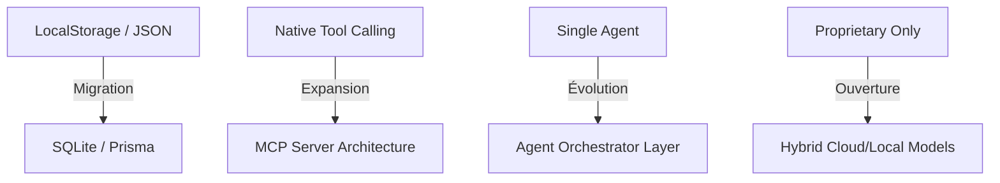

# 🗺️ Roadmap de Développement : NeuroChat

> **Vision** : Transformer l'interaction humain-machine en passant d'un simple outil de chat à un agent autonome, proactif et auto-évolutif, parfaitement intégré à l'environnement de travail de l'utilisateur.

---

## 🏁 Phase 0 : Fondations & Multimodalité (Terminé - v2.1.0)
*L'objectif était de créer un assistant capable de voir, d'entendre et d'agir sur le système.*

- [x] **Gemini Live Multimodal** : Flux audio full-duplex (VAD) et vision en temps réel (Screen/Cam).
- [x] **Agentic Filesystem** : Manipulation autonome de fichiers via pont IPC sécurisé.
- [x] **Navigateur Autonome v2** : Analyse sémantique des intentions et exécution de commandes web complexes.
- [x] **Dual-Vision (Cam+Écran)** : Support simultané des deux flux avec interface PiP dynamique.
- [x] **Compagnon Discret** : Protocole de silence par défaut et anti-hallucination renforcé.
- [x] **Mémoire Sémantique (RAG)** : Stockage vectoriel local (`text-embedding-004`) et recherche par contexte.
- [x] **NeuroLearning (Auto-Évolution)** : Moteur d'apprentissage automatique basé sur les retours implicites.
- [x] **Pont de Communication Tooling** : Injection de données système via `sendClientContent`.

---

## 🚀 Phase 1 : Robustesse & Échelle (v2.2 - v2.8)
*Focus sur la performance, la fiabilité des commandes et l'infrastructure de données.*

| Priorité | Fonctionnalité | Description | Statut |
| :--- | :--- | :--- | :--- |
| **P0** | **Migration SQLite** | Remplacer LocalStorage par SQLite (via `better-sqlite3`) pour gérer des milliers de vecteurs et sessions sans ralentissement. | 📋 Planifié |
| **P0** | **Tests E2E Agentiques** | Suite de tests automatisés (Playwright) pour valider que l'IA ne régresse pas sur ses capacités de navigation web. | 🚧 En cours |
| **P1** | **Gestion Multi-Comptes** | Isolation complète des données, de la mémoire et des préférences pour différents profils utilisateurs. | 📋 Planifié |
| **P1** | **Refonte UI/UX** | Passage à un design "Glassmorphism" plus premium avec micro-interactions avancées. | 🚧 En cours |
| **P2** | **Monitoring Avancé** | Dashboard de métriques sur la précision du CommandParser et la latence des sessions Gemini Live. | 📋 Planifié |

---

## 🔮 Phase 2 : L'Écosystème Agentique (v3.0)
*Transformer NeuroChat en un véritable centre d'orchestration pour le desktop.*

### 🛠️ Intégration Protocoles
- **Model Context Protocol (MCP)** : Support complet du standard Anthropic pour connecter NeuroChat à des bases de données externes (Notion, GitHub, Slack, etc.) de manière standardisée.
- **Local Code Interpreter** : Exécution sécurisée de scripts Python/JS dans un bac à sable (sandbox) pour l'analyse de données et l'automatisation.

### 🎭 Intelligence Collective
- **Multi-Agent Collaboration** : Capacité de déléguer des sous-tâches à des agents spécialisés (ex: un agent pour la recherche, un agent pour le code).
- **Proactivité Contextuelle** : L'assistant propose des actions en fonction de ce qu'il voit à l'écran sans sollicitation explicite (ex: "Je vois que vous rédigez un mail, voulez-vous que je vérifie les chiffres ?").

---

## 🌌 Phase 3 : Ubiquité & Souveraineté (v4.0+)
*Porter l'expérience au-delà du desktop tout en garantissant une confidentialité absolue.*

- [ ] **Souveraineté Totale (Ollama)** : Support optionnel des modèles locaux pour un fonctionnement 100% hors-ligne (Llama 3, Mistral, DeepSeek).
- [ ] **NeuroChat Mobile** : Application compagnon (React Native) synchronisée via le cloud personnel (E2EE).
- [ ] **Chiffrement de Bout en Bout** : Sécurisation de la base de données vectorielle et de l'historique des sessions.
- [ ] **Plugin Marketplace** : Permettre à la communauté de créer et partager des "Skills" (compétences) personnalisés.

---

## 🏗️ Évolution de la Stack Technique

---

## 📋 Backlog & Idées en Vrac
- 💡 **Mode "Ghostwriter"** : L'IA suggère du texte en temps réel dans n'importe quelle application.
- 💡 **Génération de Rapports PDF** : Créer des synthèses visuelles de projets à partir des fichiers locaux.
- 💡 **Contrôle Vocal de l'OS** : "Mets mon ordinateur en veille dans 10 minutes" ou "Monte le volume".

---
> 📅 **Dernière mise à jour** : 16 mai 2026
> ✍️ **Statut** : Version 2.2.0-beta (Vision & Empathy) en production.
