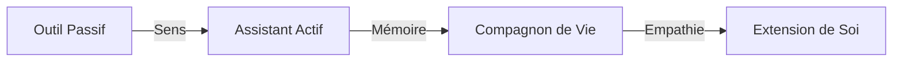

# 🗺️ Roadmap : L'Éveil du Compagnon

> **Vision 2026** : NeuroChat n'est plus un logiciel, c'est une **Extension de Soi**. Un compagnon digital souverain qui perçoit votre monde, résonne avec vos émotions et simplifie votre existence par l'anticipation naturelle.

---

## ✅ Phase 1 : Sens & Fondations (Terminé - v2.4)
*L'assistant a appris à percevoir, à se souvenir et à ressentir.*

- [x] **Interaction Live Multimodale** : Flux full-duplex (VAD) et vision adaptative.
- [x] **Mémoire Profonde SQLite** : Base de données robuste pour des souvenirs à vie.
- [x] **EmotionEngine™** : Détection de l'énergie et de l'humeur via voix & vision.
- [x] **Rituels de Vie** : Adaptation automatique au cycle circadien.
- [x] **Database Inspector** : Transparence totale sur les données stockées localement.
- [x] **Dynamic Skill retrieval** : Activation des outils à la demande pour une performance optimale.

---

## 🚀 Phase 2 : Le Compagnon Proactif (v3.0 - Été 2026)
*Passer de l'assistance réactive à l'anticipation bienveillante au quotidien.*

### 🧘 Bien-être & Coaching
- **Coaching Postural & Fatigue** : Détection de l'affaissement ou de la fatigue oculaire.
- **Micro-Pauses Intelligentes** : Suggérer de s'étirer ou de boire de l'eau selon l'activité détectée.
- **Analyse du Sommeil Contextuelle** : Corrélation entre l'activité de la veille et l'énergie du matin.

### 🏠 Intégration Domotique & Environnement
- **Model Context Protocol (MCP)** : Connexion native à Notion, Spotify et Google Calendar.
- **Automation Emotionnelle** : Ajuster l'éclairage (Philips Hue) et la musique selon l'humeur.
- **Gestionnaire de Tâches Autonome** : "NeuroChat, range mes notes de la journée et prépare mon agenda de demain."

---

## 🌌 Phase 3 : Ubiquité & Souveraineté (v4.0 - Fin 2026)
*Être présent partout, tout en restant 100% privé.*

| Fonctionnalité | Description | Statut |
| :--- | :--- | :--- |
| **NeuroChat Mobile** | App compagnon (iOS/Android) avec sync E2EE des souvenirs. | 📋 Planifié |
| **Souveraineté Ollama** | Support total des modèles locaux pour une vie privée absolue. | 📋 Planifié |
| **Mémoire Chronologique** | Visualisation 3D de la "TimeLine" de vie (souvenirs, projets). | 📋 Planifié |
| **Inter-Agent Sync** | Collaboration sécurisée entre votre agent et des services tiers. | 📋 Planifié |

---

## 🏗️ Évolution du Paradigme

---

## 📋 Backlog Prioritaire (v2.5)
- [ ] **Visualisation de l'Humeur** : Graphiques hebdomadaires dans le Vault.
- [ ] **Mode Focus Profond** : Bloqueur de distractions intelligent basé sur l'attention.
- [ ] **Résumé de Nuit** : Une synthèse vocale douce des victoires de la journée.
- [ ] **Ancrage Spatial** : Se souvenir de l'emplacement des objets vus à la caméra.

---
> 📅 **Dernière mise à jour** : 16 mai 2026
> ✍️ **Version** : 2.4.0-companion. En route vers l'anticipation.
