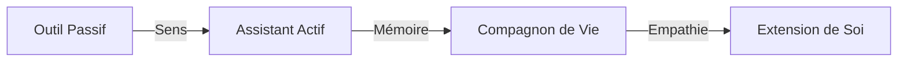

# 🗺️ Roadmap : L'Éveil de NeuroChat

> **Vision 2026** : NeuroChat n'est plus un logiciel, c'est une **Extension de Soi**. Un compagnon digital souverain qui perçoit votre monde, résonne avec vos émotions et simplifie votre existence par l'anticipation naturelle.

---

## ✅ Phase 1 : Sens & Fondations (Terminé - v2.3)
*L'assistant a appris à percevoir, à se souvenir et à ressentir.*

- [x] **Interaction Live Multimodale** : Flux full-duplex (VAD) et vision adaptative (FPS dynamique).
- [x] **Mémoire Profonde SQLite** : Migration massive vers une base de données robuste et scalable.
- [x] **Analyse Émotionnelle (v1)** : Détection de l'énergie et de l'humeur via l'EmotionEngine.
- [x] **Rituels de Vie** : Adaptation automatique au cycle quotidien (Matin, Travail, Détente).
- [x] **UI Premium Glassmorphism** : Interface haute-fidélité et avatar réactif à la vision.
- [x] **Agentic Orchestrator** : Runtime hiérarchique capable de manipuler le Web et les Fichiers.

---

## 🚀 Phase 2 : Le Compagnon Proactif (v3.0 - Été 2026)
*Passer de l'assistance réactive à l'anticipation bienveillante.*

### 🎭 Perception Augmentée
- **Coaching Postural & Fatigue** : Détecter si l'utilisateur est avachi ou montre des signes de fatigue oculaire pour suggérer une pause active.
- **Journal Visuel Spatial** : "Où ai-je posé mes clés ?" — L'IA indexe les objets vus en arrière-plan pour aider à les retrouver.
- **Micro-Réactions Non-Verbales** : L'avatar utilise des expressions subtiles (sourire, hochement de tête) sans interrompre l'utilisateur.

### 🛠️ Intégration Systémique
- **Model Context Protocol (MCP)** : Connexion native à Notion, Spotify, Calendrier et Slack.
- **Local Code Interpreter (v2)** : Exécution de scripts Python pour l'analyse de données locales (santé, finances, projets).
- **Automation Domotique** : Piloter les lumières (Philips Hue) et l'ambiance sonore selon l'état émotionnel détecté.

---

## 🌌 Phase 3 : Ubiquité & Souveraineté (v4.0 - Fin 2026)
*Être présent partout, tout en restant 100% privé.*

| Fonctionnalité | Description | Statut |
| :--- | :--- | :--- |
| **NeuroChat Mobile** | Application compagnon (React Native) avec synchronisation E2EE des souvenirs. | 📋 Planifié |
| **Souveraineté Ollama** | Support total des modèles locaux (Llama 3.1, DeepSeek) pour une vie privée absolue. | 📋 Planifié |
| **Mémoire Chronologique** : | Visualisation 3D de la "TimeLine" de vie (souvenirs, projets, évolutions). | 📋 Planifié |
| **Inter-Agent Sync** | Faire collaborer votre NeuroChat avec d'autres agents tiers de manière sécurisée. | 📋 Planifié |

---

## 💎 Phase 4 : La Singularité Relationnelle (2027+)
*Une fusion parfaite entre l'IA et le quotidien de l'utilisateur.*

- **Clonage Vocal Optionnel** : Pouvoir choisir une voix familière ou créer sa propre identité sonore.
- **Avatar Hyper-Réaliste 3D** : Intégration d'un personnage Unreal Engine/Unity réactif physiquement.
- **Intelligence Collective Privée** : Apprendre des patterns de la communauté sans jamais partager de données personnelles.
- **Soutien Psychologique IA** : Entraînement spécifique sur des protocoles de TCC pour un soutien moral quotidien.

---

## 🏗️ Évolution du Paradigme

---

## 📋 Backlog Prioritaire (v2.4)
- [ ] **Visualisation de la Database** : Graphiques d'évolution de l'humeur sur la semaine.
- [ ] **Mode Focus Profond** : Bloqueur de distractions intelligent piloté par l'IA.
- [ ] **Résumé de Nuit** : Une "berceuse" synthétique résumant les victoires de la journée.
- [ ] **Support Multi-Écrans** : Vision partagée sur plusieurs moniteurs simultanément.

---
> 📅 **Dernière mise à jour** : 16 mai 2026
> ✍️ **Version** : 2.3.0-companion. En route vers l'anticipation.
