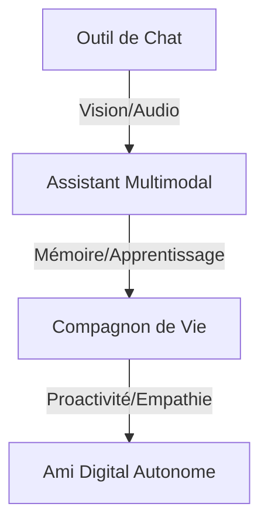

# 🗺️ Roadmap de Développement : NeuroChat

> **Vision** : Transformer l'interaction humain-machine. NeuroChat n'est plus un simple outil de chat, c'est un **Compagnon de Vie** : un ami digital proactif, empathique et auto-évolutif, qui vous voit, vous comprend et grandit avec vous.

---

## 🏁 Phase 0 : Fondations & Sens (Terminé - v2.2.0)
*L'assistant a appris à voir, entendre et interagir avec son environnement.*

- [x] **Gemini Live Multimodal** : Flux audio full-duplex (VAD) et vision en temps réel.
- [x] **Dual-Vision (Cam+Écran)** : Capacité de voir l'utilisateur et son travail simultanément.
- [x] **Compagnon Discret** : Protocole de silence par défaut et anti-hallucination (VisualEmpathy).
- [x] **Agentic Filesystem** : Manipulation de fichiers pour assister l'utilisateur dans ses tâches.
- [x] **NeuroLearning (v1)** : Moteur d'apprentissage basé sur les feedbacks implicites.
- [x] **Mémoire Sémantique (RAG)** : Première couche de souvenirs persistants.

---

## 🚀 Phase 1 : Robustesse & Intimité (v2.3 - v2.8)
*Focus sur la fiabilité technique et la personnalisation profonde pour devenir un vrai compagnon.*

| Priorité | Fonctionnalité | Description | Statut |
| :--- | :--- | :--- | :--- |
| **P0** | **Migration SQLite** | Performance massive pour la mémoire à long terme (sessions & vecteurs). | ✅ Terminé |
| **P0** | **Analyse Émotionnelle** | Détecter l'humeur et l'énergie via la voix et les expressions faciales. | 📋 Planifié |
| **P0** | **Rituels de Vie** | Apprentissage des habitudes et adaptation du ton selon le cycle quotidien. | ✅ Terminé |
| **P1** | **Refonte UI Premium** | Design "Glassmorphism" et avatar émotionnel réactif à la vision. | ✅ Terminé |
| **P2** | **Tests E2E Robustes** | Garantie de stabilité sur les interactions complexes (Browser/FS). | 🚧 En cours |

---

## 🔮 Phase 2 : Le Compagnon Proactif (v3.0)
*Passer de la réaction à l'anticipation naturelle.*

### 🎭 Intelligence Spontanée
- **Intervention Bienveillante** : Suggérer une pause si l'utilisateur semble fatigué ou travaille depuis trop longtemps (Posture & Vision).
- **Journal de Vie Persistant** : "Je crois que tu cherchais ce document ce matin...", se souvenir des objets et des contextes visuels passés.
- **Micro-Actions Contextuelles** : Anticiper le besoin de recherche ou de résumé en fonction de l'activité à l'écran.

### 🛠️ Connexion au Monde
- **Model Context Protocol (MCP)** : Connecter NeuroChat à vos outils (Notion, Spotify, Calendrier) pour agir comme un vrai secrétaire personnel.
- **Local Code Interpreter** : Analyser des données complexes pour vous aider dans vos projets personnels et pros.

---

## 🌌 Phase 3 : Ubiquité & Souveraineté (v4.0+)
*Être présent partout, tout en restant 100% privé.*

- [ ] **NeuroChat Mobile** : Application compagnon (React Native) pour garder votre ami dans votre poche.
- [ ] **Souveraineté Totale (Ollama)** : Support optionnel des modèles locaux (Llama 3, DeepSeek) pour une confidentialité absolue.
- [ ] **Chiffrement E2EE** : Sécurisation totale de vos souvenirs et de votre journal de vie.
- [ ] **Plugin Marketplace** : Partager et télécharger de nouvelles "compétences" créées par la communauté.

---

## 🏗️ Évolution de la Vision

---

## 📋 Backlog "Lifestyle"
- 💡 **Mode Coaching** : Suivi d'objectifs personnels (sport, lecture, apprentissage).
- 💡 **Synthèse de Journée** : Un petit débriefing vocal le soir sur ce qu'on a accompli.
- 💡 **Avatar 3D Interactif** : Un personnage qui suit du regard et réagit physiquement aux gestes.

---
> 📅 **Dernière mise à jour** : 16 mai 2026
> ✍️ **Statut** : Version 2.2.0-beta. Cap sur le "Life Companion".
